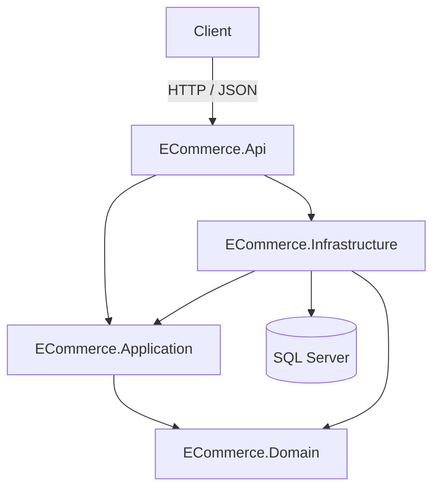
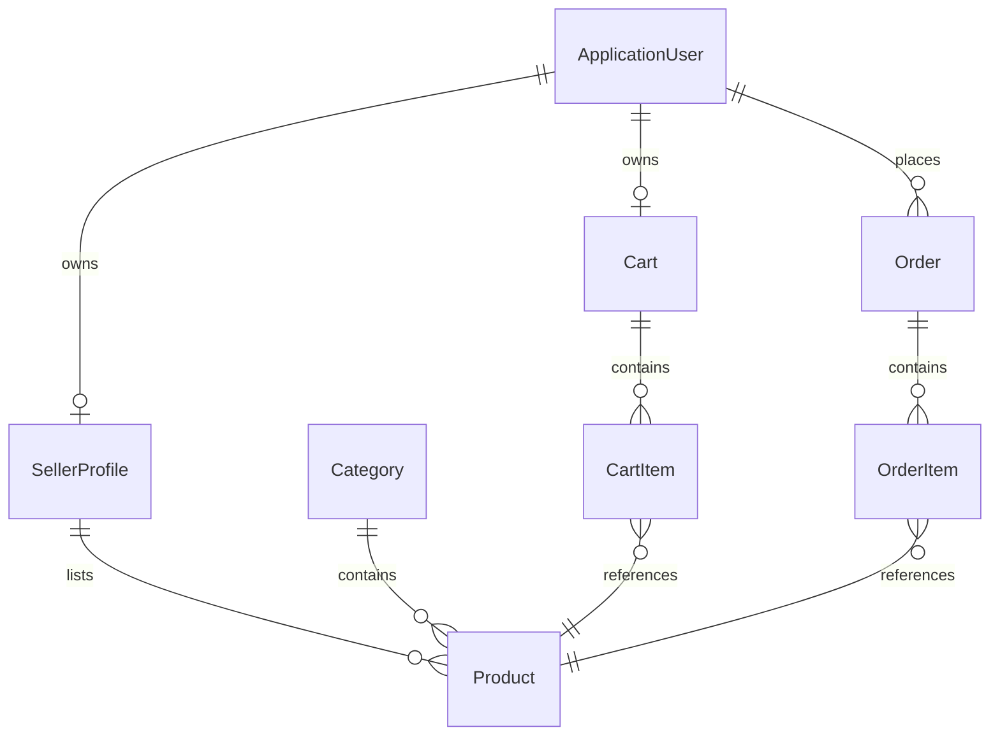

<div align="center">

# 🛍️ E-Commerce Backend API

### A maintainable, layered backend for a multi-vendor e-commerce platform

Built with **ASP.NET Core**, **Entity Framework Core**, and **Microsoft SQL Server**

</div>

---

## 📖 Table of Contents

- [Overview](#-overview)
- [Features](#-features)
- [Architecture](#-architecture)
- [Tech Stack](#️-tech-stack)
- [Project Structure](#-project-structure)
- [Domain Model](#-domain-model)
- [Persistence & Database](#-persistence--database)
- [Getting Started](#-getting-started)
  - [Prerequisites](#prerequisites)
  - [Installation](#installation)
  - [Configuration](#configuration)
  - [Database Setup](#database-setup)
  - [Running the API](#running-the-api)
- [Platform Roles](#-platform-roles)
- [Authentication & Authorization](#-authentication--authorization)
- [Engineering Principles](#-engineering-principles)
- [Roadmap](#-roadmap)

---

## 📌 Overview

**E-Commerce Backend API** is a backend for a multi-vendor e-commerce platform, designed around three actors — **Customer**, **Seller**, and **Admin**. The solution is organized into a layered architecture (`ECommerce.Api`, `ECommerce.Application`, `ECommerce.Domain`, `ECommerce.Infrastructure`) with explicit dependency boundaries between HTTP concerns, application workflows, the domain model, and persistence.

The project is currently focused on establishing a solid domain model and persistence foundation. API endpoints, authentication, and the remaining marketplace workflows are being built out incrementally on top of that foundation — see [Roadmap](#-roadmap) for what's next.

The emphasis throughout is on separation of concerns, SOLID principles, dependency inversion, and a structure that stays testable and extensible as functionality is added.

---

## ✨ Features

| Area | Capabilities |
|---|---|
| **Domain Model** | Core entities for products, categories, carts, orders, and seller profiles, plus an `OrderStatus` enum reserved for future order lifecycle tracking |
| **Identity Foundation** | ASP.NET Core Identity integrated via a custom `ApplicationUser`, with role support (`IdentityRole`) wired into the data store |
| **Persistence** | EF Core with the SQL Server provider, using a single `DbContext` that combines the Identity schema with the domain schema |
| **Entity Configuration** | Relationships and delete behavior for key entities (`Cart`, `Order`, `SellerProfile`, `CartItem`, `OrderItem`) defined explicitly via EF Core Fluent API |
| **Database Migrations** | Schema created and versioned through EF Core migrations |
| **API Scaffolding** | ASP.NET Core Web API host configured with controller routing and OpenAPI document generation for the Development environment |
| **Secure Local Configuration** | Connection strings kept out of source control via .NET User Secrets |

---

## 🏗 Architecture

The solution follows a layered architecture with explicit dependency boundaries between projects.



| Layer | Responsibility |
|---|---|
| **ECommerce.Api** | ASP.NET Core Web API host — application startup and configuration (`Program.cs`), dependency injection, controller routing. A `Controllers/` folder is scaffolded but no controllers are implemented yet. |
| **ECommerce.Application** | Intended home for use cases, services, DTOs, and contracts. `DTOs/`, `Interfaces/`, and `Services/` folders are scaffolded; the project references `ECommerce.Domain` but has no implementation yet. |
| **ECommerce.Domain** | Core business entities and enums. Has no dependencies on any other project. |
| **ECommerce.Infrastructure** | EF Core `DbContext`, ASP.NET Core Identity integration, Fluent API entity configurations, and database migrations. References both `ECommerce.Application` and `ECommerce.Domain`. |

---

## 🛠️ Tech Stack

- **Language:** C#
- **Framework:** .NET 10 / ASP.NET Core Web API
- **ORM:** Entity Framework Core (SQL Server provider)
- **Identity:** ASP.NET Core Identity
- **Database:** Microsoft SQL Server
- **API Docs:** OpenAPI (`Microsoft.AspNetCore.OpenApi`)
- **Source Control:** Git & GitHub

---

## 📂 Project Structure

```text
ECommerce.Api.slnx
├── ECommerce.Api/
│   ├── Controllers/                     # Scaffolded, currently empty
│   ├── Properties/
│   │   └── launchSettings.json
│   ├── Program.cs
│   ├── appsettings.json
│   └── appsettings.Development.json
├── ECommerce.Application/
│   ├── DTOs/                            # Scaffolded, currently empty
│   ├── Interfaces/                      # Scaffolded, currently empty
│   └── Services/                        # Scaffolded, currently empty
├── ECommerce.Domain/
│   ├── Entities/
│   └── Enums/
├── ECommerce.Infrastructure/
│   ├── Identity/
│   ├── Migrations/
│   └── Persistence/
│       └── Configurations/
├── README.md
└── .gitignore
```

---

## 🧩 Domain Model

Business entities live in `ECommerce.Domain`. `ApplicationUser` extends ASP.NET Core Identity's `IdentityUser` and lives in `ECommerce.Infrastructure/Identity`, adding `FirstName`, `LastName`, and `CreatedAt`.



- **Product** — `Name`, `Description`, `Price`, `Quantity`, `IsActive`; belongs to one `Category` and one `SellerProfile`.
- **Category** — `Name`; has many `Product`s.
- **SellerProfile** — `StoreName`, `Description`, `CreatedAt`; one-to-one with `ApplicationUser`; has many `Product`s.
- **Cart** — one-to-one with `ApplicationUser`; has many `CartItem`s.
- **CartItem** — links a `Cart` to a `Product`, with a `Quantity`.
- **Order** — many-to-one with `ApplicationUser`; has many `OrderItem`s.
- **OrderItem** — links an `Order` to a `Product`, with its own `UnitPrice` and `UnitQuantity` fields.

An `OrderStatus` enum (`Pending`, `Paid`, `Processing`, `Shipped`, `Delivered`, `Cancelled`) is defined in `ECommerce.Domain.Enums` for future order lifecycle tracking; it is not yet wired to the `Order` entity.

---

## 🗄️ Persistence & Database

- **`ECommerceDbContext`** (in `ECommerce.Infrastructure/Persistence`) extends `IdentityDbContext<ApplicationUser>`, combining ASP.NET Core Identity's schema (users, roles, claims, logins, tokens) with `DbSet`s for `Products`, `Categories`, `Carts`, `CartItems`, `Orders`, `OrderItems`, and `SellerProfiles`.
- Entity relationships are configured through `IEntityTypeConfiguration<T>` classes under `Persistence/Configurations/`: `Cart`, `SellerProfile`, and `Order` are each linked to `ApplicationUser` by foreign key, with `Cart` and `SellerProfile` enforced as one-to-one via a unique index on `UserId`. `CartItem` and `OrderItem` explicitly configure `NoAction` delete behavior on their `Product` foreign key to avoid multiple cascade paths in SQL Server.
- `Product`'s relationships to `Category` and `SellerProfile` are established through EF Core's default conventions from the entity's navigation properties, rather than explicit configuration classes.
- Database schema is created and versioned through EF Core migrations; a single `InitialCreate` migration currently defines the full schema, including primary keys, foreign keys, and indexes for both the Identity and domain tables.

---

## 🚀 Getting Started

### Prerequisites

- [.NET 10 SDK](https://dotnet.microsoft.com/download)
- SQL Server (LocalDB, a full instance, or a container)
- EF Core CLI tools — `dotnet tool install --global dotnet-ef`
- Git

### Installation

```bash
git clone https://github.com/NazarPishchuk/ecommerce-backend-api.git
cd ecommerce-backend-api
dotnet restore
```

### Configuration

The database connection string is kept out of source control using [.NET User Secrets](https://learn.microsoft.com/en-us/aspnet/core/security/app-secrets):

```bash
dotnet user-secrets set "ConnectionStrings:ECommerceDbConnectionString" "<your-connection-string>" --project ECommerce.Api/ECommerce.Api.csproj
```

### Database Setup

Apply the EF Core migration to create the schema:

```bash
dotnet ef database update --project ECommerce.Infrastructure/ECommerce.Infrastructure.csproj --startup-project ECommerce.Api/ECommerce.Api.csproj
```

### Running the API

```bash
dotnet run --project ECommerce.Api/ECommerce.Api.csproj
```

By default the API listens on `http://localhost:5216` and `https://localhost:7037` (see `launchSettings.json`). No controllers are implemented yet, so the running API does not currently expose any application routes.

---

## 👥 Platform Roles

The platform is designed around three primary roles. They currently exist as an authorization/domain concept rather than fully implemented API workflows:

### 🧑‍💻 Customer
Intended to browse the catalog, manage a shopping cart, and place orders. Represented by a standard `ApplicationUser`, linked to a `Cart` and `Order` history.

### 🏪 Seller
Intended to manage a seller profile, product listings, and inventory. Represented by a `SellerProfile` linked one-to-one to an `ApplicationUser`.

### 🛡️ Admin
Intended to manage users, sellers, and platform-level moderation. Not yet represented by a dedicated entity — planned to be modeled through ASP.NET Core Identity roles.

---

## 🔐 Authentication & Authorization

ASP.NET Core Identity is currently integrated as the foundation for user and role management: `ApplicationUser` (extending `IdentityUser`) and `IdentityRole` are registered via `AddIdentityCore<ApplicationUser>().AddRoles<IdentityRole>()`, with EF Core as the backing store. This provides password hashing and the persistence layer for users, roles, and claims.

JWT-based API authentication and role/policy enforcement have not been implemented yet — the request pipeline currently has no authentication scheme registered. These will be introduced as the authentication layer is built out.

---

## 🎯 Engineering Principles

- Separation of concerns across API, Application, Domain, and Infrastructure layers
- SOLID principles and dependency inversion
- Explicit, intentional dependency boundaries between projects
- Relational data integrity managed through EF Core conventions and explicit Fluent API configuration
- Secure, environment-based configuration (no secrets in source control)
- A structure intended to stay testable and extensible as functionality is added

---

## 🗺️ Roadmap

- [ ] Category and Product REST endpoints
- [ ] Search, filtering, sorting, and pagination for product browsing
- [ ] User registration and login
- [ ] JWT-based authentication
- [ ] Role-based authorization (Customer / Seller / Admin policies)
- [ ] Cart management endpoints
- [ ] Order processing workflow
- [ ] Payment workflow
- [ ] Centralized validation and error handling
- [ ] Logging and health checks
- [ ] Unit and integration tests
- [ ] Docker support
- [ ] Response caching
- [ ] Asynchronous messaging
- [ ] CI/CD pipeline
- [ ] Seller profile and product ownership workflows
